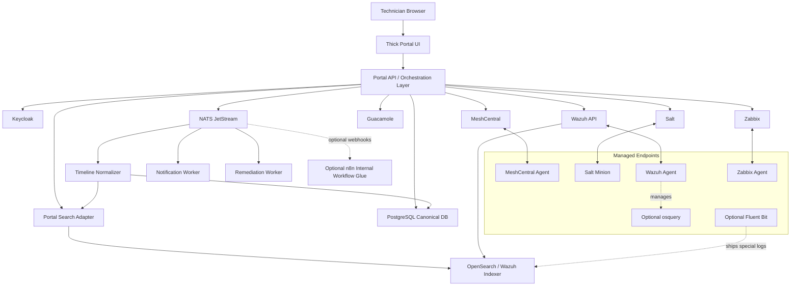
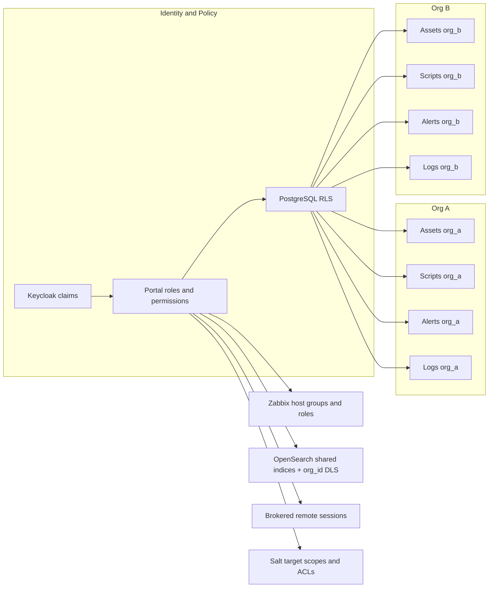
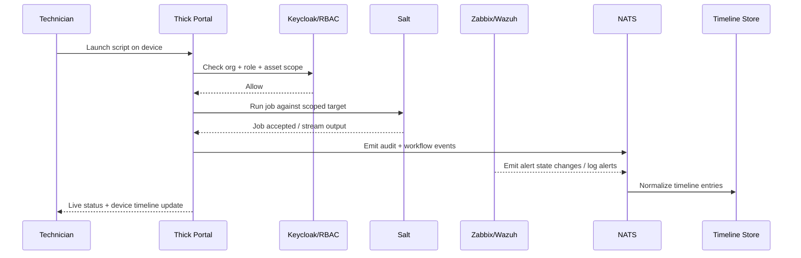

# Building a Free and Open-Source MSP RMM with Commercial-Grade Parity

## Executive summary

The clearest conclusion is that a full-featured MSP RMM can be built from a free and open-source core, but **not** by selecting a single product. The credible path is a **thick internal control plane** that becomes the system of record for identity, tenancy, RBAC, audit, device timeline, and cross-system workflows. Specialized capability engines sit behind that portal: **MeshCentral** for remote desktop/terminal/files, **Salt** for endpoint execution and scheduling, **Zabbix** for monitoring and alerting, **Wazuh** plus **OpenSearch** for inventory/log/search, **Keycloak** for SSO and authorization, **PostgreSQL** for canonical multi-tenant data, and **NATS JetStream** for event fan-out and durable workflow messaging.

The core design decisions are now resolved:

- **Endpoint footprint:** accept multiple agents per managed endpoint for maximum parity: MeshCentral agent, Salt minion, Wazuh agent, and Zabbix agent. Add osquery or Fluent Bit only for endpoints or estates that need deeper queries or special log shipping.
- **Log isolation:** use shared Wazuh/OpenSearch indices for v1, with mandatory `org_id` enrichment and OpenSearch document-level security (DLS). Keep all search behind a portal search adapter so per-org indices can be introduced later without changing technician workflows.
- **Technician access:** enforce portal-only operation for technicians. Direct subsystem UI/API access is reserved for platform administrators and audited break-glass maintenance.
- **Workflow layer:** keep AWX out of the core roadmap. If a workflow builder is added later, prefer **n8n** for internal glue such as tickets, approvals, notifications, onboarding/offboarding, reporting, and webhook/API automations.

Against the documented NinjaOne-style commercial baseline, parity is high for remote access, endpoint scripting/automation, threshold alerting, inventory, and log visibility. The main shortfall remains the single-pane product experience: the open stack does not provide that out of the box. The portal is therefore not a cosmetic wrapper; it is the product boundary that turns several mature tools into one operator-facing RMM.

The license posture remains manageable because the project is internal-use first. The core stack can stay weighted toward permissive FOSS components, while strong-copyleft components such as Zabbix and Wazuh are isolated behind subsystem boundaries. n8n is different: it is source-available/fair-code under n8n's Sustainable Use License, not OSI open source, so it belongs only as an optional internal automation layer rather than part of the FOSS core. This report is an engineering analysis, not legal advice.

The best deployment posture is **hybrid**: centralize the portal, Keycloak, PostgreSQL, NATS, and canonical audit/timeline services; keep monitoring proxies and remote-session infrastructure close to managed estates where practical; and run log/index storage with explicit hot/warm/cold retention policy.

## Baseline comparison and parity assessment

The commercial baseline to match includes a single-pane device action experience, organization-scoped inventory, device details with user and event logs, policy-scoped scheduled automations, alert notifications, remote access, remote background operations, file browser, registry/event tooling, and PowerShell/CMD-style shells. NinjaOne's public docs are a useful reference point for the shape of those workflows, especially remote support, remote tools, CLI access, and background mode.

| Required capability | Commercial baseline shape | Implementation route | Parity assessment | Main caveat |
|---|---|---|---|---|
| Unified GUI | Device actions from dashboards, device lists, tickets, and device pages. | Build a custom portal UI over subsystem APIs, with embedded or brokered remote sessions and normalized workflows. | **Medium initially, High after custom build** | No single OSS tool gives this natively; the portal is the RMM. |
| Organization separation and inventory | Organizations, locations, groups, and device details expose hardware, software, user, and event data. | Keycloak + PostgreSQL RLS as the hard tenant boundary; Wazuh Syscollector for inventory; Zabbix host groups/roles for monitoring views. | **High** | Tenant logic must be centralized in the portal, not delegated ad hoc to each subsystem. |
| Remote desktop, terminals, files | Remote control, background mode, file browser, registry/event tooling, and command shells. | MeshCentral for managed endpoint desktop/terminal/files; Guacamole for browser RDP/VNC/SSH jump access. | **High for managed endpoints** | Linux/macOS user-context terminal parity is weaker than the Windows SYSTEM/user split. |
| Scripts and automations | Policy-scoped scheduled automations, custom scripts, notifications, and scoped execution contexts. | Salt remote execution + scheduler + eAuth/ACLs. n8n can later coordinate business workflows around Salt, but does not replace Salt on endpoints. | **High** | The script library, approvals, policy wrapper, and operator UX must be custom portal work. |
| Alerting and escalation | Notification channels, thresholds, repeated notifications, and remediation hooks. | Zabbix for thresholds/escalations/actions; portal normalizes dedupe, acknowledgements, and remediation context. | **High** | Cross-tool dedupe is custom if Wazuh/security alerts and Zabbix alerts both feed the timeline. |
| Logs, retention, search | Device event/user logs exposed in the device view. | Wazuh Logcollector + OpenSearch shared indices with `org_id` enrichment, DLS, ISM retention, and portal-mediated search. | **Above baseline potential** | More operational complexity than a bundled commercial product. |

The practical takeaway is straightforward: **feature parity is obtainable, but product parity must be built**. The control plane owns the experience, permissions, audit chain, and cross-system timeline.

## Recommended stack and candidate projects

The recommended stack maximizes feature depth while keeping the most customized layers permissively licensed: UI, portal API, canonical data, event bus, and remote-access brokering.

### Control plane, tenancy, and identity

| Project | Role in the system | License posture | Recommendation |
|---|---|---|---|
| React or Vue | Portal UI shell, device pages, cross-system workflows. | MIT. | Use React unless the team already has stronger Vue experience. |
| FastAPI or Django | Portal API/BFF, orchestration API, connector facade. | MIT for FastAPI; BSD-3-Clause for Django. | Use FastAPI for API-first orchestration unless Django admin is a major requirement. |
| Keycloak | SSO, OIDC/SAML, centralized RBAC/ABAC policy model. | Apache 2.0. | Use one internal realm for MSP operators. Avoid realm-per-customer unless customer IdP isolation becomes a real requirement. |
| PostgreSQL | Canonical org/user/asset/script/audit database; tenant enforcement via RLS. | PostgreSQL License. | Store all tenant-bound canonical state with `org_id`; enable RLS before feature pages are built. |
| NATS JetStream | Durable event bus, workflow fan-out, timeline ingestion. | Apache 2.0. | Use retained streams and durable pull consumers; make consumers idempotent because delivery is at-least-once. |

**Design choice:** use **one internal Keycloak realm for MSP operators**, with org-scoped claims and portal-side authorization mapped into PostgreSQL RLS. This preserves centralized staff identity and keeps the customer-org boundary in the portal and database rather than in subsystem-specific human accounts.

### Remote access, terminals, and file operations

| Project | Coverage | License posture | Recommendation |
|---|---|---|---|
| MeshCentral | Desktop GUI, terminals, file transfer, device events, agent-native remote support, OIDC/embedding/login-token style integration. | Apache 2.0. | Make MeshCentral the primary remote engine for fully managed endpoints. |
| Apache Guacamole | Browser-based RDP/VNC/SSH, file transfer, recordings, OIDC SSO, extension-based integration. | Apache 2.0. | Use Guacamole as a secondary protocol gateway for agentless or jump-host scenarios. |

MeshCentral and Guacamole should be treated as capability engines behind the portal. Normal technicians launch remote sessions only through portal-brokered, time-limited actions. Direct subsystem consoles are restricted to platform administrators and break-glass maintenance.

### Automation, alerting, inventory, and logs

| Project | Best-fit responsibility | License posture | Recommendation |
|---|---|---|---|
| Salt | Endpoint script execution, ad-hoc commands, schedules, orchestration, eAuth/ACL-backed execution scoping. | Apache 2.0. | Make Salt the primary endpoint automation substrate. Store scripts, revisions, approvals, and schedule ownership in the portal. |
| Zabbix | Threshold monitoring, host inventory, escalations, notifications, remote-script hooks, proxies. | AGPLv3 from Zabbix 7.0 onward. | Use Zabbix as the monitoring/alerting engine, but keep technician alert workflows portal-native. |
| Wazuh | Endpoint inventory, log collection, security/event alerts, optional osquery management. | Wazuh core identifies GPLv2; package/component licenses must be verified for the release adopted. | Use Wazuh inventory as an early seed for the asset graph and Wazuh logs as the primary log/security-event input. |
| OpenSearch | Search, index lifecycle management, tenant-safe DLS/FLS controls, long-term retention. | Apache 2.0 for OpenSearch core. | Use shared v1 indices with `org_id` enrichment and DLS. Hide search behind a portal adapter. |
| Fluent Bit | Extra edge log shipping and special-case collectors. | Apache 2.0. | Optional. Use only where Wazuh Logcollector is not enough or where edge buffering/routing is useful. |
| osquery | Deep endpoint inspection/querying, ideally managed through Wazuh. | Apache 2.0 or GPL-2.0-only option depending on package choice. | Optional. Use for targeted estates, not as a universal v1 dependency. |

**Salt remains the endpoint execution layer.** n8n is useful later for human/business workflow glue, but it should call portal APIs or webhook endpoints that in turn invoke Salt, Zabbix, Wazuh, or ticketing systems. It should not become a parallel technician console or a second endpoint execution authority.

### Optional internal workflow automation

| Project | Role | License posture | Recommendation |
|---|---|---|---|
| n8n | Internal workflow glue for tickets, approvals, notifications, reporting, onboarding/offboarding, and webhook/API automations. | Sustainable Use License / Enterprise License; source-available/fair-code, not OSI open source. | Add only after the core RMM flows are stable. Keep it internal and behind portal-owned authorization boundaries. |
| AWX | Ansible-style workflow/runbook layer. | AWX repo license is Apache 2.0, but releases are paused during a large refactor. | Do not include in the core roadmap. Re-evaluate only if Ansible-heavy runbooks become a stronger requirement than n8n-style integration workflows. |

### Log isolation decision

Use **shared Wazuh/OpenSearch indices with mandatory `org_id` enrichment plus OpenSearch DLS** for v1. This is the easiest model to implement, manage, and change later because it preserves native Wazuh/OpenSearch index lifecycle patterns while avoiding per-org index sprawl.

Implementation requirements:

- Every indexed log, alert, inventory, and timeline-search document must include a stable keyword `org_id` assigned by the portal's asset/connector mapping.
- Technician search must go through a portal search adapter that applies portal authorization and issues OpenSearch queries under roles constrained by DLS.
- DLS policies should be simple exact-match filters on `org_id` wherever possible; do not rely on text-analyzed fields for security filters.
- Per-org indices remain a future migration path for high-volume, regulated, or contractually isolated customers. The portal search adapter is the compatibility layer that makes that future change manageable.
- Wazuh dashboard tenants are not the hard tenant boundary. They help isolate dashboard objects, saved searches, and index patterns, but the data boundary is portal authorization plus OpenSearch security controls.

### Agent operations

Multiple agents per endpoint are accepted for parity, so agent lifecycle management must be first-class rather than treated as incidental packaging.

- Build a unified installer/bootstrapper per OS that enrolls MeshCentral, Salt, Wazuh, and Zabbix with the correct org/site/device metadata and writes connector IDs back to the portal.
- Track per-agent health in the asset graph: installed version, service state, last check-in, last successful job/log/metric, enrollment identity, and update channel.
- Manage version drift with rings: lab, internal endpoints, pilot customer/site, then broad deployment. Block broad rollout when any agent has elevated crash, reconnect, CPU, memory, or bandwidth signals.
- Budget resource impact explicitly. Tune Wazuh Syscollector intervals, Zabbix item intervals, Salt schedule concurrency, and MeshCentral relay usage so endpoints do not feel like four unrelated products are competing for the same machine.
- Provide per-agent rollback and re-enrollment playbooks. A failed update to one agent should not require reinstalling the entire endpoint stack.

## Target architecture

The architecture treats subsystem tools as **pluggable capability engines**, not as peer systems with independent operator identities. The portal owns users, orgs, roles, permissions, asset IDs, script definitions, schedules, audit records, and the normalized device timeline. Subsystems own specialized execution and telemetry.

The design principle is that **every subsystem scope is derived from portal tenancy**, not vice versa. MeshCentral domains, Wazuh tenants, Zabbix groups, and OpenSearch roles are useful implementation mechanisms, but they are synchronized from the portal. They are not allowed to become separate operator truth.

## Deployment patterns, scaling, and security

**On-premises** is the easiest model for data sovereignty and minimizing exposure of relays and logs. It is especially attractive for high log retention, sensitive customer datasets, or regulated environments.

**Cloud-hosted** is viable for the portal, identity, bus, and search tiers, but remote-session economics matter. MeshCentral relay paths can be bandwidth-heavy, so direct/WebRTC paths and regional relay placement should be planned.

**Hybrid** is the recommended production posture. Put the thick portal, Keycloak, PostgreSQL, and NATS in a central control plane; use Zabbix proxies for distributed monitoring; use Wazuh distributed deployment or clustering where ingest volume demands it; and centralize searchable retention in OpenSearch with explicit ISM policies.

From a scaling perspective:

- **PostgreSQL** stores canonical tenancy, asset identity, connector IDs, permissions, schedules, credentials metadata, audit records, and timeline pointers. Enable RLS on tenant-bound tables and design around default-deny behavior.
- **NATS JetStream** carries idempotent workflow messages and timeline events. Use durable pull consumers for horizontally scaled workers.
- **OpenSearch** stores long-lived searchable logs and timeline-search documents. Use shared indices, `org_id` keyword fields, DLS, role mappings, and lifecycle policies.
- **Zabbix** should be proxy-based in remote networks and API-integrated rather than used as the primary technician UI.
- **Wazuh** should be clustered/distributed only when ingest volume, endpoint count, or retention requirements justify it.
- **n8n**, if added, should be deployed as an internal integration service with portal-owned credentials and least-privilege API access.

The largest security risks are scope leaks and privilege ambiguity:

- **Keycloak:** centralize human identity and keep resource scopes explicit.
- **PostgreSQL:** use RLS and understand owner/superuser bypass rules.
- **OpenSearch:** require DLS for technician search roles and keep DLS filters simple.
- **MeshCentral/Guacamole:** force portal-brokered launch for technicians; reserve direct consoles for platform admins.
- **Salt:** use eAuth/ACLs, scoped target expressions, and network hardening so the Salt layer cannot become a free-form root shell outside portal policy.
- **n8n:** never expose it as a technician operations console; use it only to coordinate approved portal/API workflows.

## Implementation roadmap and effort

The most important execution decision is sequencing. Build the tenancy, identity, asset graph, event model, and agent lifecycle before piling on subsystem UI surfaces. That keeps the system from becoming a brittle federation.

### Recommended implementation order

| Workstream | Main components | Outcome | Complexity | Estimated effort | Notes |
|---|---|---|---|---|---|
| Portal shell and identity | React or Vue, FastAPI or Django, Keycloak, PostgreSQL | Login, org switcher, RBAC, audit identity, basic device pages | **High** | **High** | Foundation of the thick portal requirement. |
| Canonical asset graph | PostgreSQL, Wazuh inventory ingest, connector ID mapping | One `asset_id` per endpoint with foreign IDs for MeshCentral/Salt/Wazuh/Zabbix/Guacamole | **High** | **High** | Required for cross-system workflows and timeline joins. |
| Agent operations | Unified installer, update rings, health reporting, rollback playbooks | Repeatable multi-agent enrollment and lifecycle management | **Medium-High** | **Medium-High** | Required because multiple agents per endpoint are accepted. |
| Remote broker | MeshCentral launch tokens; Guacamole SSO/extension path | Launch desktop/terminal/files from portal with audit | **Medium-High** | **Medium-High** | Start with MeshCentral; add Guacamole second. |
| Automation engine | Salt targets, ACLs, scheduler, secret references | Script library, ad-hoc runs, schedules, org-scoped targeting | **Medium-High** | **Medium-High** | Salt is authoritative for endpoint execution. |
| Monitoring and alerting | Zabbix hosts/templates/actions/webhooks | Threshold alerts, escalation rules, remediation hooks | **Medium** | **Medium** | Normalize alert events into NATS and the portal timeline. |
| Logs and search | Wazuh, OpenSearch, ISM, DLS, portal search adapter | Log collection, archive retention, org-safe search | **Medium-High** | **Medium-High** | Use shared indices with `org_id` and DLS for v1. |
| Unified timeline and audit | NATS, PostgreSQL, OpenSearch | Operator actions + alerts + scripts + sessions + logs in one device timeline | **High** | **High** | This is where integrations become an RMM product. |
| Optional workflow glue | n8n, portal webhooks/APIs, ticketing/notification integrations | Approvals, ticket sync, reporting, internal automations | **Medium** | **Medium** | Add after core RMM workflows are stable. |
| Hardening and HA | TLS, reverse proxies, backup, DR, scaling | Production readiness | **Medium** | **Medium** | Done after feature paths are stable enough to harden. |

### Step-by-step plan

Begin by defining the **canonical domain model** in PostgreSQL: organizations, users, roles, permissions, assets, connector identities, scripts, schedule definitions, audit events, credentials metadata, alert records, and search/timeline pointers. Use `org_id` on all tenant-bound entities and enable RLS before building feature pages.

Configure **Keycloak** as the only human-facing identity provider for technicians. Keep technicians out of direct MeshCentral, Zabbix, Wazuh, Guacamole, OpenSearch, and n8n logins. Platform admins may retain direct access for maintenance, with separate privileged roles and audit.

Build the **agent enrollment path** before exposing many technician features. The installer should enroll the MeshCentral agent, Salt minion, Wazuh agent, and Zabbix agent, then write connector IDs and version/health signals into the portal asset graph.

Integrate **Wazuh inventory first** to seed the asset graph. Map each Wazuh agent ID to the canonical `asset_id`, then attach MeshCentral node IDs, Salt minion IDs, Zabbix host IDs, and Guacamole connection references as connectors.

Add **MeshCentral** as the first visible technician feature. Build a launch broker that records intent, checks scope, generates a time-limited session launch, and writes audit/timeline entries before and after the session.

Add **Salt** next. Model scripts in the portal, store revisions and parameter metadata there, and publish execution requests to Salt using portal-generated target expressions. Use eAuth and ACLs so Salt cannot execute outside the portal's permission model. Use Salt schedules for recurring jobs, but keep the authoritative schedule object in the portal.

Integrate **Zabbix** after automation. Use Zabbix for metrics, triggers, severity, actions, repeat notifications, escalations, and remediation hooks. Normalize Zabbix events into the portal timeline and expose portal-native alert pages to technicians.

Layer in **Wazuh logs + OpenSearch search/retention** using the v1 shared-index model. Enrich every indexed document with `org_id`, enforce DLS for search roles, and route all technician search through the portal search adapter.

Build the **unified device timeline** across operator actions, alert states, remote sessions, script runs, inventory changes, and log/security events.

Add **n8n** only after those core workflows are stable. Its first use cases should be internal coordination around the portal: approval reminders, ticket creation/update, notification routing, customer onboarding/offboarding checklists, and scheduled reports.

## Testing and validation checklist

A serious MSP-grade build should be validated as a **multi-tenant control plane**, not merely as a set of successful integrations.

### Tenancy and RBAC

Verify that every portal page, API call, asset lookup, script launch, remote session launch, alert acknowledgement, and log query is denied by default outside the correct `org_id` scope. Test direct-object references, search/filter APIs, and forged connector IDs. Validate that PostgreSQL RLS blocks cross-org reads and writes even if application code makes a bad query.

### Agent operations

Validate installation, enrollment, service health, update rings, version drift detection, reinstall, uninstall, and per-agent rollback on Windows, macOS, and Linux. Track CPU, memory, disk, log volume, and network usage while all required agents are installed. Confirm a failed update to one agent does not orphan the endpoint or break unrelated agents.

### Remote access

Validate desktop launch, terminal launch, file upload/download, clipboard behavior, session recording choices, and audit entries for MeshCentral and Guacamole separately. Confirm normal technicians cannot reach direct MeshCentral or Guacamole consoles outside portal-brokered launch.

### Automation

Validate org-scoped script targeting, parameter handling, credential injection, concurrency controls, cancellation behavior, schedule execution, and output capture. Confirm Salt ACLs match portal permissions. Validate that n8n, if present, can trigger only approved portal/API workflows and cannot execute arbitrary endpoint commands directly.

### Monitoring and alerting

Validate trigger thresholds, alert open/reset flows, repeat notifications, delayed notifications, escalation paths, acknowledgements, and automated remediation hooks. Confirm Zabbix events are deduplicated and mapped into the portal timeline, and that per-org views do not leak another org's alert objects or dashboards.

### Logs and search

Validate Wazuh log ingestion for Windows, Linux, macOS, and network/syslog sources. Confirm every indexed document has the correct `org_id`. Run positive and negative search tests against the portal adapter and OpenSearch DLS roles. Validate OpenSearch rollover/deletion policies and prove that Wazuh dashboard tenants are not mistaken for complete data isolation.

### Performance, HA, and failure handling

Load-test remote relays, timeline workers, Salt job bursts, Zabbix proxy outages, Wazuh ingest spikes, and OpenSearch rollover under load. Test NATS consumer replay and idempotency. Test PostgreSQL backup/restore and point-in-time recovery.

### Security validation

Run permission-boundary tests on every subsystem connector. Validate TLS, certificate trust, host-key pinning where applicable, portal launch-token expiry, secret rotation, privileged admin workflows, and audit completeness. Confirm direct subsystem URLs are blocked or restricted to platform engineers and break-glass roles.

## Recommended conclusion and resolved decisions

The best overall answer to your requirement set is:

- **Portal/UI:** React
- **Portal API/BFF:** FastAPI
- **SSO / AuthZ:** Keycloak
- **Canonical data / tenancy / audit:** PostgreSQL with RLS
- **Event bus / workflow messaging:** NATS JetStream
- **Primary remote engine:** MeshCentral
- **Secondary protocol gateway:** Apache Guacamole
- **Endpoint execution:** Salt
- **Monitoring / alerting / escalations:** Zabbix
- **Inventory / logs / security-event ingestion:** Wazuh + OpenSearch
- **Log isolation:** shared indices with mandatory `org_id` enrichment and OpenSearch DLS for v1
- **Optional deep OS queries:** osquery managed through Wazuh
- **Optional extra shippers / edge collectors:** Fluent Bit
- **Optional later workflow glue:** n8n, internal-only and not part of the FOSS core stack
- **Non-core / deferred:** AWX

That stack gives the best tradeoff between feature depth, integration realism, and license manageability for an internal-only MSP control plane. The engineering center of gravity is the **portal**, not the subsystems. The now-finalized operational constraints are multiple agents per endpoint, shared-index-plus-DLS log isolation, portal-only technician access, Salt as the endpoint automation substrate, and n8n only as a later internal workflow layer.

## Selected references

- [NinjaOne Remote][ninja-remote]
- [NinjaOne Remote Tools][ninja-remote-tools]
- [NinjaOne CLI][ninja-cli]
- [NinjaOne Background Mode][ninja-background]
- [MeshCentral documentation][meshcentral-docs]
- [Apache Guacamole documentation][guacamole-docs]
- [Salt scheduler][salt-scheduler]
- [Salt external authentication][salt-eauth]
- [Zabbix license][zabbix-license]
- [Zabbix remote commands][zabbix-remote-commands]
- [Wazuh system inventory][wazuh-inventory]
- [Wazuh log data collection][wazuh-logcollector]
- [Wazuh core repository/license note][wazuh-repo]
- [Wazuh organization repositories][wazuh-org]
- [OpenSearch document-level security][opensearch-dls]
- [OpenSearch Index State Management][opensearch-ism]
- [Keycloak Authorization Services][keycloak-authz]
- [PostgreSQL row security policies][postgres-rls]
- [NATS JetStream][nats-jetstream]
- [n8n Sustainable Use License][n8n-license]
- [AWX repository][awx-repo]
- [AWX license][awx-license]

[ninja-remote]: https://www.ninjaone.com/docs/endpoint-management/remote-control/ninjaone-remote/
[ninja-remote-tools]: https://www.ninjaone.com/docs/endpoint-management/remote-tools/remote-tools/
[ninja-cli]: https://www.ninjaone.com/docs/endpoint-management/scripting-and-automation/command-line-interface-cli/using-command-line-interface-cli/
[ninja-background]: https://www.ninjaone.com/docs/background-mode/
[meshcentral-docs]: https://docs.meshcentral.com/
[guacamole-docs]: https://guacamole.apache.org/doc/gug/
[salt-scheduler]: https://docs.saltproject.io/salt/user-guide/en/latest/topics/scheduler.html
[salt-eauth]: https://docs.saltproject.io/en/master/topics/eauth/index.html
[zabbix-license]: https://www.zabbix.com/license
[zabbix-remote-commands]: https://www.zabbix.com/documentation/7.4/en/manual/config/notifications/action/operation/remote_command
[wazuh-inventory]: https://documentation.wazuh.com/current/user-manual/capabilities/system-inventory/index.html
[wazuh-logcollector]: https://documentation.wazuh.com/current/user-manual/capabilities/log-data-collection/how-it-works.html
[wazuh-repo]: https://github.com/wazuh/wazuh
[wazuh-org]: https://github.com/wazuh
[opensearch-dls]: https://docs.opensearch.org/docs/security/access-control/document-level-security/
[opensearch-ism]: https://docs.opensearch.org/latest/im-plugin/ism/index/
[keycloak-authz]: https://www.keycloak.org/docs/latest/authorization_services/index.html
[postgres-rls]: https://www.postgresql.org/docs/current/ddl-rowsecurity.html
[nats-jetstream]: https://docs.nats.io/nats-concepts/jetstream
[n8n-license]: https://docs.n8n.io/sustainable-use-license/
[awx-repo]: https://github.com/ansible/awx
[awx-license]: https://github.com/ansible/awx/blob/devel/LICENSE.md
