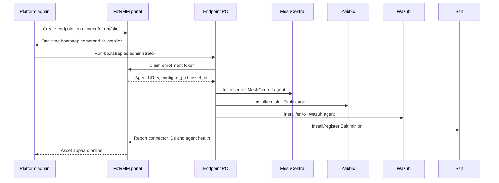

# Endpoint Deployment

The Docker install starts the FizRMM application: portal, API, and PostgreSQL. The control plane can issue endpoint enrollment tokens and downloadable Windows PowerShell and Linux shell bootstrap scripts. Optional backing-service containers are available separately for adapter development, but endpoint bootstrap generation does not require them.

Real remote access and monitoring still require the FizRMM adapters to finish configuring MeshCentral, Zabbix, Wazuh, and Salt plus OS-specific agent installer URLs. Without those URLs configured, the bootstrappers can claim/report the endpoint but will skip agent installation.

To manage a real PC, FizRMM needs an endpoint enrollment flow that installs and registers the agent bundle for that organization/site/device. The planned default endpoint footprint is:

- MeshCentral agent for remote desktop, terminal, and file access.
- Zabbix Agent 2 for metrics and monitoring.
- Wazuh agent for logs, inventory, and security events.
- Salt minion for script execution and scheduled jobs.
- Optional osquery or Fluent Bit only for special cases.

## Deployment Model

The PC should not be configured manually inside each subsystem. The portal should generate a one-time enrollment package that carries org/site policy and returns subsystem configuration to the installer.



## Windows PC Flow

For a Windows PC, create an enrollment token:

```bash
curl -X POST \
  -H 'Content-Type: application/json' \
  -H 'X-FizRMM-Orgs: org_acme' \
  -d '{"org_id":"org_acme","site":"Acme HQ","expires_hours":24}' \
  http://127.0.0.1:8000/api/enrollments
```

The response includes:

- `token`
- `bootstrap_url`
- `command`

The portal **Enroll endpoint** view also exposes these values and includes a direct `fizrmm-bootstrap.ps1` download link.

Download the bootstrap script:

```bash
curl -o fizrmm-bootstrap.ps1 http://127.0.0.1:8000/api/enrollments/<token>/bootstrap.ps1
```

Run the script on the Windows PC from an elevated PowerShell session:

```powershell
powershell.exe -ExecutionPolicy Bypass -File .\fizrmm-bootstrap.ps1 `
  -PortalUrl "http://127.0.0.1:8000" `
  -EnrollmentToken "<token>"
```

The bootstrapper should:

1. Verify it is running as local administrator.
2. Call the portal to claim the one-time enrollment token.
3. Receive `org_id`, `site_id`, `asset_id`, server URLs, installer URLs, checksums, and agent configuration.
4. Install the MeshCentral agent silently.
5. Install Zabbix Agent 2 silently with active monitoring configured.
6. Install the Wazuh agent silently and enroll it to the Wazuh manager.
7. Install the Salt minion silently and set minion ID/grains for `org_id`, `site_id`, and `asset_id`.
8. Start and validate all services.
9. Report connector IDs, versions, service state, and last check-in to the portal.

Preferred mass deployment methods:

- Microsoft Intune Win32 app.
- Group Policy startup script.
- RMM-to-RMM migration script from an existing tool.
- Manual elevated PowerShell for a small pilot.


## Linux Endpoint Flow

For a Linux endpoint, create the same enrollment token with `POST /api/enrollments`. The response now includes:

- `linux_bootstrap_url`
- `linux_command`

Download and run the Linux bootstrap script as root:

```bash
curl -fsSL http://127.0.0.1:8000/api/enrollments/<token>/bootstrap.sh -o fizrmm-bootstrap.sh
sudo bash ./fizrmm-bootstrap.sh
```

Or run the one-line `linux_command` returned by the API/portal. The Linux bootstrapper:

1. Verifies it is running as root.
2. Claims the enrollment token with hostname and Linux OS information.
3. Downloads configured Linux installer URLs when present.
4. Falls back to `skipped_no_installer_url` reports when an installer is not configured.
5. Reports MeshCentral/Zabbix/Wazuh/Salt connector status back to FizRMM.

Linux-specific installer overrides can be passed to the API container with these environment variables:

- `MESHCENTRAL_LINUX_AGENT_INSTALLER_URL` / `MESHCENTRAL_LINUX_AGENT_INSTALL_ARGS`
- `ZABBIX_LINUX_AGENT_INSTALLER_URL` / `ZABBIX_LINUX_AGENT_INSTALL_ARGS`
- `WAZUH_LINUX_AGENT_INSTALLER_URL` / `WAZUH_LINUX_AGENT_INSTALL_ARGS`
- `SALT_LINUX_MINION_INSTALLER_URL` / `SALT_LINUX_MINION_INSTALL_ARGS`

The generic `*_INSTALLER_URL` values are used as fallback if Linux-specific values are empty.

## Network Requirements

The preferred model is outbound-only from the endpoint, which works better for NAT and customer firewalls.

Typical traffic:

| Component | Endpoint direction | Purpose |
|---|---:|---|
| MeshCentral agent | Outbound to MeshCentral HTTPS/WebSocket endpoint | Remote desktop, terminal, files |
| Zabbix Agent 2 | Outbound active checks to Zabbix server/proxy | Monitoring metrics |
| Wazuh agent | Outbound to Wazuh manager/enrollment services | Logs, inventory, security events |
| Salt minion | Outbound to Salt master or syndic/proxy | Script execution and job results |
| FizRMM portal API | Outbound HTTPS during enrollment | Bootstrap token claim and connector reporting |

Exact ports should be generated from the server-side configuration, not hard-coded into the bootstrapper.

## What The Portal Must Build Next

Implemented now:

- `POST /api/enrollments`: create a one-time enrollment token for an org/site.
- `POST /api/enrollments/{token}/claim`: return endpoint bootstrap configuration.
- `POST /api/enrollments/{token}/report`: write installed connector IDs and agent health.
- `GET /api/enrollments/{token}/bootstrap.ps1`: download a Windows bootstrap script.
- `GET /api/enrollments/{token}/bootstrap.sh`: download a Linux bootstrap script.

Still required before real PC remote/monitoring works:

- `POST /api/assets/{asset_id}/agent-health`: update agent state after enrollment.
- A secure download route for signed bootstrap scripts or packaged installers.
- Server integrations for MeshCentral, Zabbix, Wazuh, and Salt.
- Production token hardening: hashed tokens, strict expiry enforcement, single-use lockout, and audit review.
- Signed Windows installer/package generation.

The portal must stay the authority for `org_id`, `asset_id`, and technician access. MeshCentral, Zabbix, Wazuh, and Salt receive scoped configuration from the portal; they should not become independent sources of tenant truth.

## Agent Metadata

Every installed agent should carry enough metadata to rejoin the canonical asset graph:

- `org_id`
- `site_id`
- `asset_id`
- hostname
- operating system
- installation batch ID
- update channel
- connector external ID

Examples:

- Zabbix: host metadata or host tags.
- Wazuh: agent group and labels.
- Salt: minion ID and grains.
- MeshCentral: device group and custom details if available.

## Success Criteria

A PC is successfully deployed when:

- The asset appears in FizRMM under the correct organization.
- MeshCentral reports the device online and remote launch is brokered from the portal.
- Zabbix reports active metrics for the device.
- Wazuh reports inventory and log data for the device.
- Salt accepts a scoped job for the device and returns output.
- The portal timeline shows enrollment, agent health, and any test remote/script actions.
- A technician from another org receives `403` for the asset.

## Current State

Implemented now:

- Portal/API/PostgreSQL Docker control plane.
- Seeded asset records and agent health records.
- Tenant-aware API behavior and portal views.
- Endpoint enrollment tokens.
- Windows bootstrap script generation.
- Linux bootstrap script generation.
- Endpoint claim/report APIs.
- Fake remote-session and script-run requests that write timeline events.

Not implemented yet:

- MeshCentral server integration.
- Zabbix server/proxy integration.
- Wazuh manager/indexer integration.
- Salt master integration.
- Signed Windows/macOS/Linux package installers; generated Windows and Linux bootstrap scripts exist now.
- Real remote control, monitoring, log collection, or script execution.
